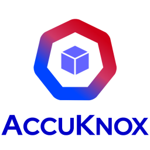

<div align="center">



# AccuKnox xBOM Scan — Azure DevOps Extension

**Generate, upload, and store Bills of Materials directly from your Azure Pipelines.**

</div>

---

## Overview

The **AccuKnox xBOM** task integrates into your Azure DevOps pipeline to:

- 🔍 **Scan** source code, container images, Go projects, or AI/ML models
- 📦 **Generate** CycloneDX 1.6 BOMs (SBOM, CBOM, AIBOM)
- ☁️ **Upload** results to the AccuKnox Console
- 💾 **Attach** the BOM to the pipeline run as a downloadable artifact

---

## Supported BOM Types

| Type | Source | Use Case |
|---|---|---|
| `sbom` | Filesystem or container image | Packages, libraries, dependencies |
| `cbom` | Go source or container image | Crypto algorithms, certs, protocols |
| `aibom` | HuggingFace model or AWS Bedrock | AI/ML model inventory |

> ⚠️ **Linux agents only.** The task downloads a `linux_amd64` CLI build. Use `ubuntu-latest` or a Linux self-hosted agent.

---

## Setup

### 1. Store credentials as secret variables

Define these under **Pipelines → Library → Variable groups**, or as secret variables on the pipeline. Mark every one of them **secret**.

| Variable | Description |
|---|---|
| `ACCUKNOX_TOKEN` | AccuKnox API token. [How to create](https://help.accuknox.com/how-to/how-to-create-tokens/) |
| `ACCUKNOX_ENDPOINT` | AccuKnox endpoint, e.g. `cspm.accuknox.com` |
| `ACCUKNOX_LABEL` | AccuKnox label. [How to create](https://help.accuknox.com/how-to/how-to-create-labels/) |

Required for AIBOM with Bedrock only:

| Variable | Description |
|---|---|
| `AWS_ACCESS_KEY_ID` | AWS access key with the `bedrock:ListFoundationModels` permission |
| `AWS_SECRET_ACCESS_KEY` | Matching AWS secret access key |

### 2. Create a Project in the AccuKnox Console

Uploaded BOMs are associated with a Project, so create one before the first run.

1. Log in to the AccuKnox Dashboard
2. Navigate to **SBOM → Projects**
3. Click **New Project**
4. Fill in the details:
   - **Name** (required): used as `projectName` in the pipeline
   - **Description**: short description of the project
   - **Classifier** (required): must match the `projectClassifier` input
   - **Tags** (optional)
5. Click **Create**

> 📌 `projectName` and `projectClassifier` must **exactly** match the values on the Project in the Console, or the upload will not associate correctly.

---

## Usage

### 📦 SBOM from Filesystem

> Scans the repository source tree for packages and dependencies.

```yaml
- task: AccuKnox-xBOM@1
  inputs:
    bomType: sbom
    scanPath: '.'
    accuknoxEndpoint: $(ACCUKNOX_ENDPOINT)
    accuknoxToken: $(ACCUKNOX_TOKEN)
    accuknoxLabel: $(ACCUKNOX_LABEL)
    projectName: my-project
    projectClassifier: application
```

| Name | Description | Possible Options | Required |
|---|---|---|---|
| `bomType` | Type of BOM to generate | `sbom` | **Yes** |
| `scanPath` | Directory to scan | Any valid directory path | No (default: `.`) |
| `accuknoxEndpoint` | AccuKnox hostname | Hostname only, no `https://` | **Yes** |
| `accuknoxToken` | AccuKnox API token | Token from the Console | **Yes** |
| `accuknoxLabel` | AccuKnox label | Label from the Console | **Yes** |
| `projectName` | AccuKnox project name | Any string | **Yes** |
| `projectClassifier` | CycloneDX classifier | `application`, `firmware`, `library` | **Yes** |

---

### 🐳 SBOM from Container Image

> Scans a built container image for installed packages. Build the image in the same job; the task only needs the tag.

```yaml
- script: |
    IMAGE="myapp:$(Build.SourceVersion)"
    docker build -t "$IMAGE" .
    echo "##vso[task.setvariable variable=IMAGE]$IMAGE"
  displayName: Build image

- task: AccuKnox-xBOM@1
  inputs:
    bomType: sbom
    imageRef: $(IMAGE)
    accuknoxEndpoint: $(ACCUKNOX_ENDPOINT)
    accuknoxToken: $(ACCUKNOX_TOKEN)
    accuknoxLabel: $(ACCUKNOX_LABEL)
    projectName: my-project
    projectClassifier: container
```

| Name | Description | Possible Options | Required |
|---|---|---|---|
| `bomType` | Type of BOM to generate | `sbom` | **Yes** |
| `imageRef` | Container image reference. Build with any tool (docker, podman, buildah, ko). The build step must run in the same job. | Image tag, e.g. `myapp:abc1234` | **Yes** |
| `projectClassifier` | CycloneDX classifier | `container` | **Yes** |

> `imageRef` takes precedence over `scanPath`. Setting both logs a warning and scans the image.

---

### 🔐 CBOM from Go Source Code

> Scans Go source for cryptographic algorithms, protocols, and certificates.

```yaml
- task: AccuKnox-xBOM@1
  inputs:
    bomType: cbom
    scanPath: '.'
    accuknoxEndpoint: $(ACCUKNOX_ENDPOINT)
    accuknoxToken: $(ACCUKNOX_TOKEN)
    accuknoxLabel: $(ACCUKNOX_LABEL)
    projectName: my-project
    projectClassifier: application
```

| Name | Description | Possible Options | Required |
|---|---|---|---|
| `bomType` | Type of BOM to generate | `cbom` | **Yes** |
| `scanPath` | Directory containing Go source | Any valid directory path | No (default: `.`) |
| `projectClassifier` | CycloneDX classifier | `application`, `library` | **Yes** |

---

### 🐳 CBOM from Container Image

> Scans a container image for cryptographic algorithms, protocols, and certificates.

```yaml
- task: AccuKnox-xBOM@1
  inputs:
    bomType: cbom
    imageRef: $(IMAGE)
    accuknoxEndpoint: $(ACCUKNOX_ENDPOINT)
    accuknoxToken: $(ACCUKNOX_TOKEN)
    accuknoxLabel: $(ACCUKNOX_LABEL)
    projectName: my-project
    projectClassifier: container
```

---

### 🤖 AIBOM from a HuggingFace Model

> Inventories an AI/ML model by fetching its metadata from the HuggingFace Hub API.

```yaml
- task: AccuKnox-xBOM@1
  inputs:
    bomType: aibom
    aibomSource: huggingface
    aibomModel: google-bert/bert-base-uncased
    accuknoxEndpoint: $(ACCUKNOX_ENDPOINT)
    accuknoxToken: $(ACCUKNOX_TOKEN)
    accuknoxLabel: $(ACCUKNOX_LABEL)
    projectName: my-project
    projectClassifier: machine-learning-model
```

| Name | Description | Possible Options | Required |
|---|---|---|---|
| `bomType` | Type of BOM to generate | `aibom` | **Yes** |
| `aibomSource` | AIBOM data source | `huggingface` | No (default: `huggingface`) |
| `aibomModel` | HuggingFace model ID | e.g. `google-bert/bert-base-uncased` | **Yes** |
| `projectClassifier` | CycloneDX classifier | `machine-learning-model` | **Yes** |

---

### 🤖 AIBOM from AWS Bedrock

> Inventories every foundation model accessible in your AWS Bedrock account for the given region. Requires AWS credentials with the `bedrock:ListFoundationModels` permission.

```yaml
- task: AccuKnox-xBOM@1
  inputs:
    bomType: aibom
    aibomSource: bedrock
    awsRegion: us-east-1
    awsAccessKeyId: $(AWS_ACCESS_KEY_ID)
    awsSecretAccessKey: $(AWS_SECRET_ACCESS_KEY)
    accuknoxEndpoint: $(ACCUKNOX_ENDPOINT)
    accuknoxToken: $(ACCUKNOX_TOKEN)
    accuknoxLabel: $(ACCUKNOX_LABEL)
    projectName: my-project
    projectClassifier: machine-learning-model
```

| Name | Description | Possible Options | Required |
|---|---|---|---|
| `bomType` | Type of BOM to generate | `aibom` | **Yes** |
| `aibomSource` | AIBOM data source | `bedrock` | **Yes** |
| `awsRegion` | AWS region for the Bedrock inventory | e.g. `us-east-1`, `eu-central-1` | **Yes** |
| `awsAccessKeyId` | AWS access key ID | AWS access key string | **Yes** |
| `awsSecretAccessKey` | AWS secret access key | AWS secret key string | **Yes** |
| `projectClassifier` | CycloneDX classifier | `machine-learning-model` | **Yes** |

---

## Advanced Inputs

| Name | Description | Default |
|---|---|---|
| `outputFile` | Where to write the BOM | `<repo>-<bomType>.json` in the sources directory |
| `knoxctlVersion` | Release tag of the AccuKnox CLI to download | `v0.10.0` |
| `skipTlsVerify` | Disable TLS certificate verification on upload. Only for a Console with a self-signed certificate. | `false` |

---

## Complete Pipeline Example

```yaml
trigger:
  branches:
    include: [main, master]

pool:
  vmImage: ubuntu-latest

steps:
- checkout: self

- task: AccuKnox-xBOM@1
  displayName: AccuKnox xBOM Scan
  inputs:
    bomType: sbom
    scanPath: '.'
    accuknoxEndpoint: $(ACCUKNOX_ENDPOINT)
    accuknoxToken: $(ACCUKNOX_TOKEN)
    accuknoxLabel: $(ACCUKNOX_LABEL)
    projectName: my-project
    projectClassifier: application
```

---

## Downloading the BOM

The generated BOM is attached to the pipeline run as an artifact named `<bomType>-<buildId>`:

1. Open the pipeline run in Azure DevOps
2. Click **Related → Published artifacts** (or the artifacts icon in the run summary)
3. Expand the artifact and download the BOM file

---

## How It Works

1. **Validate inputs** – checks `bomType`, and the AIBOM source and its required credentials.
2. **Download the CLI** – fetches the AccuKnox CLI for the requested `knoxctlVersion` and extracts it to the agent temp directory.
3. **Generate the BOM** – runs the scan matching `bomType` against the image, path, or model.
4. **Validate the BOM** – fails the task if the file is missing, truncated, or not valid JSON.
5. **Patch the BOM** – stamps `project_name` and `project_classifier`, and normalises the root component name (the full image reference is preserved, tag included).
6. **Upload** – POSTs the BOM to the AccuKnox Console and fails on any non-2xx response.
7. **Publish** – attaches the BOM to the pipeline run as an artifact.

---

## Troubleshooting

| Symptom | Cause |
|---|---|
| `Failed to extract knoxctl archive` | Agent is not Linux, or `tar` is unavailable. Use a Linux agent. |
| `BOM file not found ... scan did not write any output` | The scan target was empty or unreadable. Check `scanPath` / `imageRef`. |
| `BOM file is suspiciously small` | The CLI wrote an empty or error document. Check the scan output above the error. |
| `Upload ... failed (HTTP 401)` | `accuknoxToken` is wrong or expired. |
| `Upload ... failed (HTTP 404)` | `accuknoxEndpoint` is wrong, or includes a scheme. Pass the hostname only. |
| BOM uploads but does not appear under a Project | `projectName` or `projectClassifier` does not exactly match the Console. |
